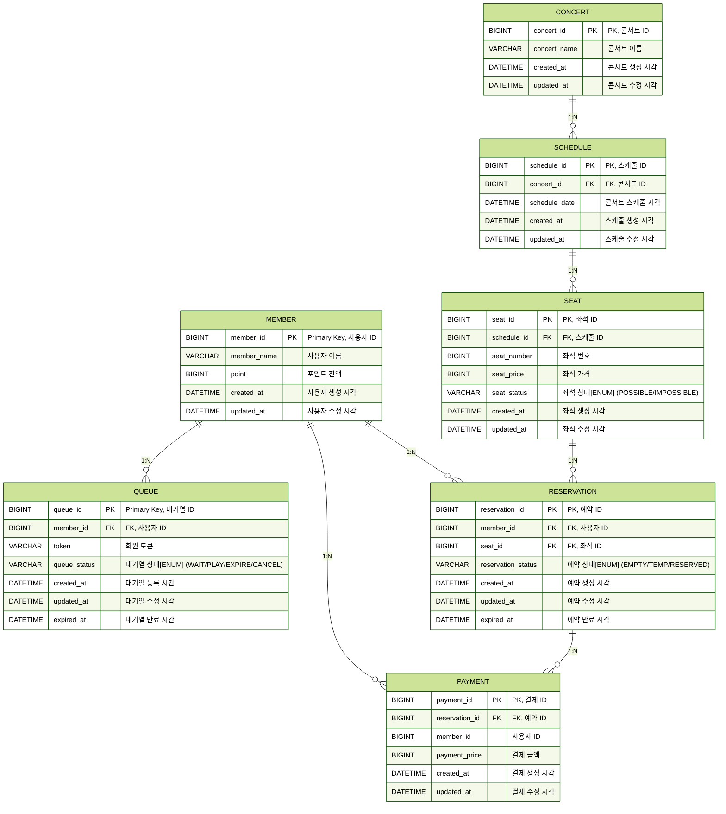

```mermaid
---
config:
  theme: forest
---
erDiagram
    QUEUE {
        BIGINT queue_id PK "Primary Key, 대기열 ID"
        BIGINT member_id FK "FK, 사용자 ID"
        VARCHAR token "회원 토큰"
        VARCHAR queue_status "대기열 상태[ENUM] (WAIT/PLAY/EXPIRE/CANCEL)"
        DATETIME created_at "대기열 등록 시간"
        DATETIME updated_at "대기열 수정 시각"
        DATETIME expired_at "대기열 만료 시간"
    }
    MEMBER{
        BIGINT member_id PK "Primary Key, 사용자 ID"
        VARCHAR member_name "사용자 이름"
        BIGINT point "포인트 잔액"
        DATETIME created_at "사용자 생성 시각"
        DATETIME updated_at "사용자 수정 시각"
    }
    PAYMENT {
        BIGINT payment_id PK "PK, 결제 ID"
        BIGINT reservation_id FK "FK, 예약 ID"
        BIGINT member_id "사용자 ID"
        BIGINT payment_price "결제 금액"
        DATETIME created_at "결제 생성 시각"
        DATETIME updated_at "결제 수정 시각"
    }
    RESERVATION {
        BIGINT reservation_id PK "PK, 예약 ID"
        BIGINT member_id FK "FK, 사용자 ID"
        BIGINT seat_id FK "FK, 좌석 ID"
        VARCHAR reservation_status "예약 상태[ENUM] (EMPTY/TEMP/RESERVED)"
        DATETIME created_at "예약 생성 시각"
        DATETIME updated_at "예약 수정 시각"
        DATETIME expired_at "예약 만료 시각"
    }
    SEAT {
        BIGINT seat_id PK "PK, 좌석 ID"
        BIGINT schedule_id FK "FK, 스케줄 ID"
        BIGINT seat_number "좌석 번호"
        BIGINT seat_price "좌석 가격"
        VARCHAR seat_status "좌석 상태[ENUM] (POSSIBLE/IMPOSSIBLE)"
        DATETIME created_at "좌석 생성 시각"
        DATETIME updated_at "좌석 수정 시각"
    }
    SCHEDULE {
        BIGINT schedule_id PK "PK, 스케줄 ID"
        BIGINT concert_id FK "FK, 콘서트 ID"
        DATETIME schedule_date "콘서트 스케줄 시각"
        DATETIME created_at "스케줄 생성 시각"
        DATETIME updated_at "스케줄 수정 시각"
    }
    CONCERT {
        BIGINT concert_id PK "PK, 콘서트 ID"
        VARCHAR concert_name "콘서트 이름"
        DATETIME created_at "콘서트 생성 시각"
        DATETIME updated_at "콘서트 수정 시각"
    }
    CONCERT ||--o{ SCHEDULE : "1:N"
    SCHEDULE ||--o{ SEAT : "1:N"
    SEAT ||--o{ RESERVATION : "1:N"
    RESERVATION ||--o{ PAYMENT : "1:N"
    MEMBER ||--o{ PAYMENT : "1:N"
    MEMBER ||--o{ RESERVATION : "1:N"
    MEMBER  ||--o{ QUEUE : "1:N"
```